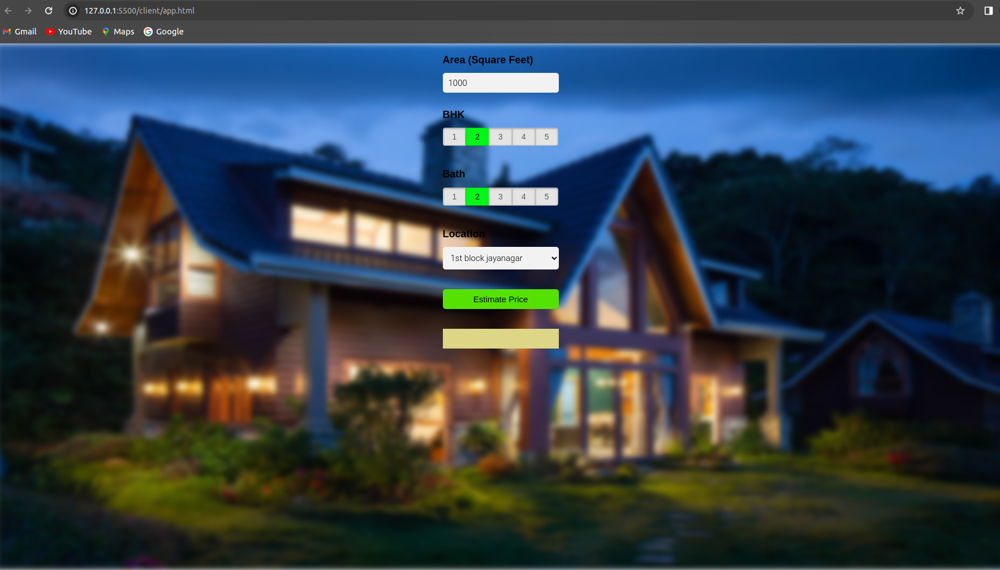

# My Project

Welcome to my  project of banglore house predicting model  
This model predict house pricing in banglore in diffrent cities across banglore  

Here I had taken data from diffrent cities in banglore  
Source of dataset used <https://www.kaggle.com/datasets/amitabhajoy/bengaluru-house-price-data>  

Install python , run `pip install flask`. 
run sever file for testing `python server.py` 
run app.html file, you will now able to use the model 
